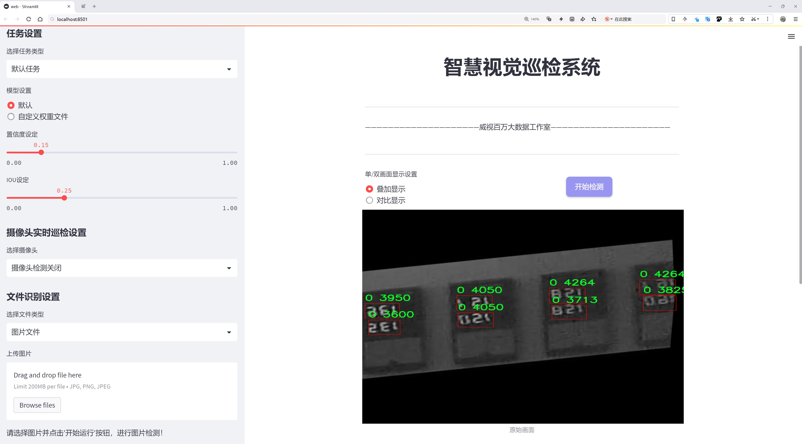
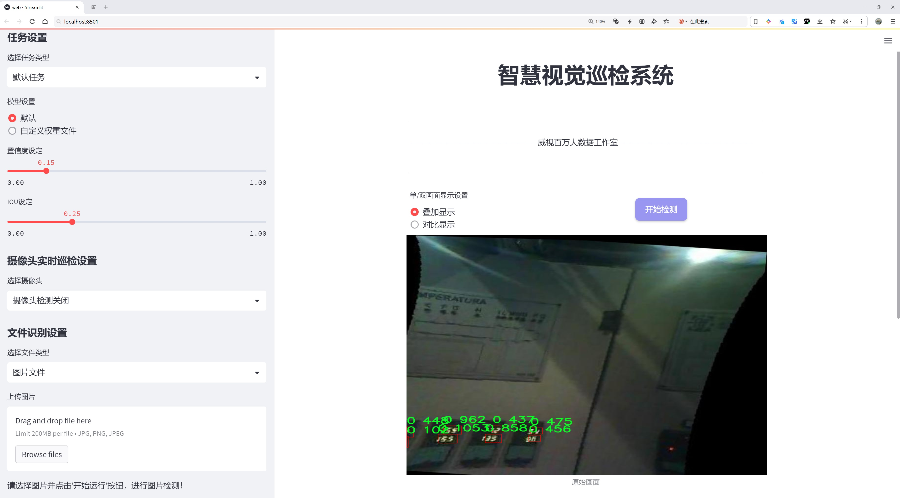
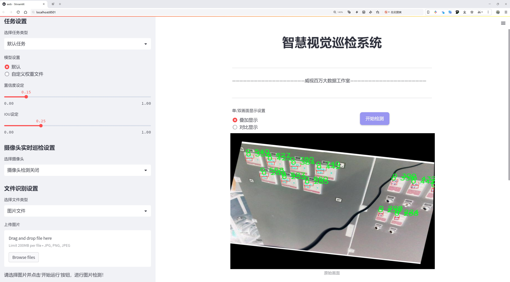
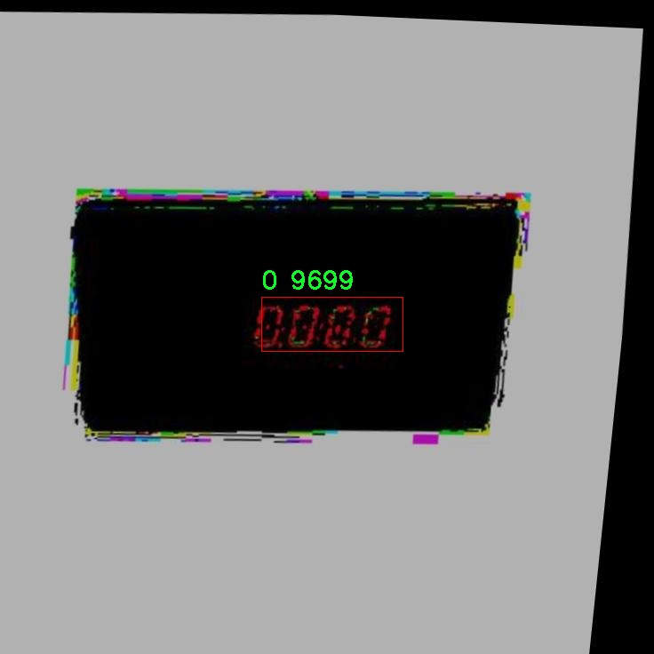
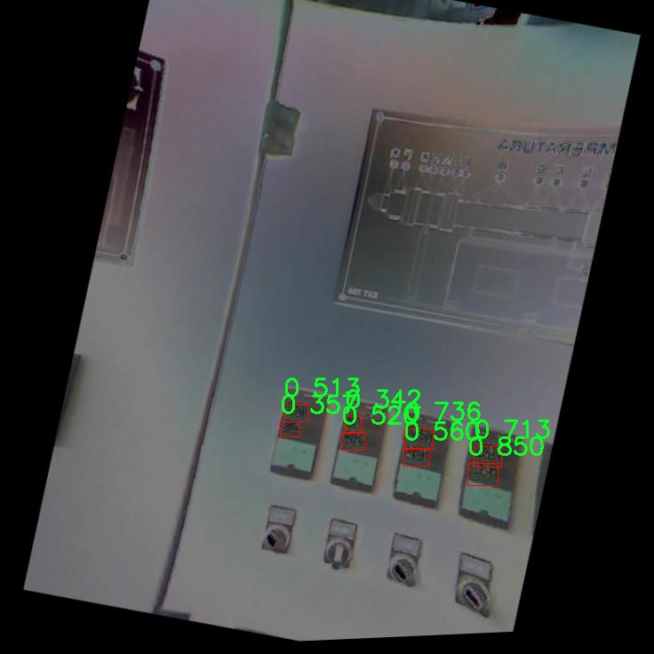
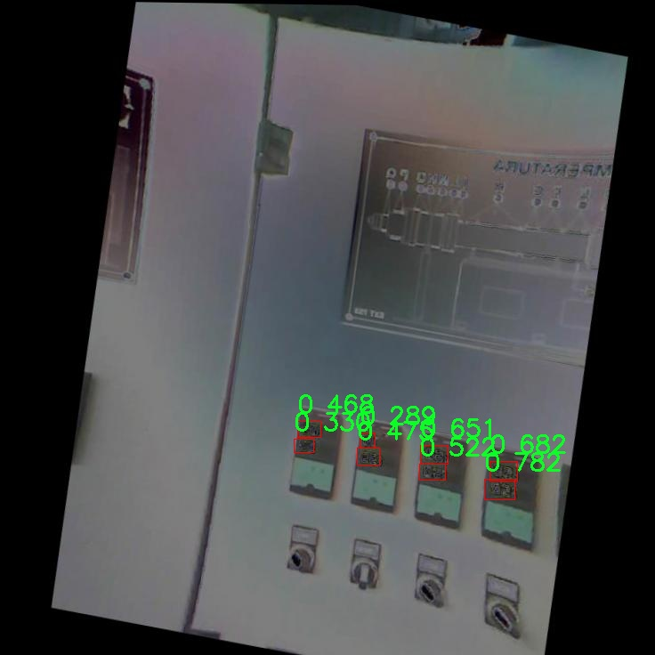
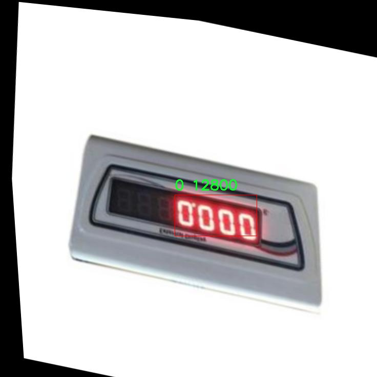
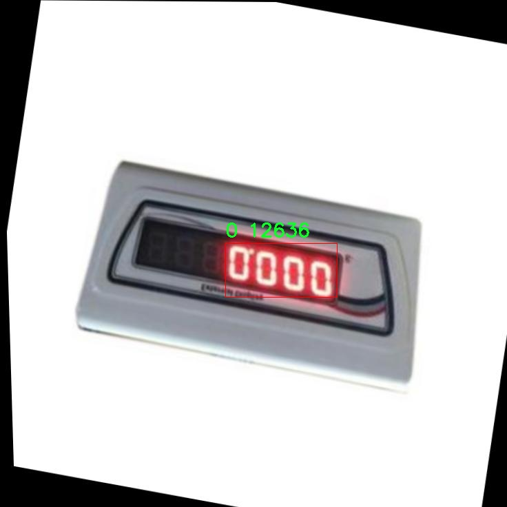

# 数码管定位检测系统源码分享
 # [一条龙教学YOLOV8标注好的数据集一键训练_70+全套改进创新点发刊_Web前端展示]

### 1.研究背景与意义

项目参考[AAAI Association for the Advancement of Artificial Intelligence](https://gitee.com/qunshansj/projects)

项目来源[AACV Association for the Advancement of Computer Vision](https://gitee.com/qunmasj/projects)

研究背景与意义

随着智能技术的迅猛发展，计算机视觉在各个领域的应用愈发广泛，尤其是在物体检测和定位方面。YOLO（You Only Look Once）系列模型因其高效的实时检测能力而受到广泛关注，特别是最新的YOLOv8版本，其在精度和速度上都取得了显著的提升。然而，尽管YOLOv8在多种物体检测任务中表现优异，但在特定应用场景下，如数码管定位，仍然存在一定的局限性。因此，基于改进YOLOv8的数码管定位系统的研究具有重要的理论和实际意义。

数码管作为一种广泛应用于电子设备中的显示元件，其定位与识别在自动化生产、智能家居、医疗设备等领域中扮演着重要角色。传统的数码管检测方法往往依赖于图像处理技术，如边缘检测和模板匹配等，这些方法在复杂环境下容易受到光照变化、背景干扰和数码管形态变化的影响，导致检测精度下降。相比之下，基于深度学习的物体检测方法能够通过大规模数据训练，自动提取特征，显著提高检测的鲁棒性和准确性。因此，结合YOLOv8的先进技术，对数码管进行高效定位，将为相关领域提供更为可靠的解决方案。

在本研究中，我们使用的数据集包含2300张图像，专注于数码管的检测任务。该数据集的设计考虑了多样性和复杂性，旨在涵盖不同光照条件、背景杂乱程度以及数码管的多种状态。这为训练改进的YOLOv8模型提供了丰富的样本，确保模型能够适应实际应用中的各种挑战。通过对YOLOv8模型的改进，如优化网络结构、调整损失函数以及增强数据集的多样性，我们期望能够进一步提升模型在数码管定位任务中的性能。

此外，研究的意义还体现在推动计算机视觉技术在工业自动化和智能制造领域的应用。随着工业4.0的到来，智能化生产线对高效、准确的视觉检测系统的需求日益增加。通过实现高精度的数码管定位，不仅可以提高生产效率，还能降低人工成本和错误率，从而提升整体生产质量。进一步地，该研究的成果还可以为其他类似的物体检测任务提供借鉴，推动计算机视觉技术在更广泛领域的应用。

综上所述，基于改进YOLOv8的数码管定位系统的研究，不仅具有重要的学术价值，也具备广泛的应用前景。通过深入探讨该领域的关键技术和方法，我们期望能够为智能视觉系统的发展贡献一份力量，同时为相关行业的技术进步提供支持。

### 2.图片演示







##### 注意：由于此博客编辑较早，上面“2.图片演示”和“3.视频演示”展示的系统图片或者视频可能为老版本，新版本在老版本的基础上升级如下：（实际效果以升级的新版本为准）

  （1）适配了YOLOV8的“目标检测”模型和“实例分割”模型，通过加载相应的权重（.pt）文件即可自适应加载模型。

  （2）支持“图片识别”、“视频识别”、“摄像头实时识别”三种识别模式。

  （3）支持“图片识别”、“视频识别”、“摄像头实时识别”三种识别结果保存导出，解决手动导出（容易卡顿出现爆内存）存在的问题，识别完自动保存结果并导出到tempDir中。

  （4）支持Web前端系统中的标题、背景图等自定义修改，后面提供修改教程。

  另外本项目提供训练的数据集和训练教程,暂不提供权重文件（best.pt）,需要您按照教程进行训练后实现图片演示和Web前端界面演示的效果。

### 3.视频演示

[3.1 视频演示](https://www.bilibili.com/video/BV1Er4neSELB/)

### 4.数据集信息展示

##### 4.1 本项目数据集详细数据（类别数＆类别名）

nc: 1
names: ['0']


##### 4.2 本项目数据集信息介绍

数据集信息展示

在本研究中，我们采用了名为“bowling”的数据集，以改进YOLOv8的数码管定位系统。该数据集的设计旨在为数码管的检测与定位提供高质量的训练样本，从而提升模型在实际应用中的准确性和鲁棒性。数据集的类别数量为1，类别列表中仅包含一个类别“0”，这表明该数据集专注于特定的数码管目标，简化了模型的学习任务。

“bowling”数据集的构建过程考虑了多样性和代表性，确保所收集的图像能够涵盖不同环境下数码管的多种表现形式。数据集中包含了多种拍摄角度、光照条件以及背景环境的图像，这对于训练一个能够在各种条件下准确识别数码管的模型至关重要。通过这种方式，模型能够学习到数码管在不同场景中的特征，从而提高其在真实世界应用中的适应能力。

在数据集的图像标注过程中，采用了高精度的标注工具，确保每一张图像中的数码管位置都得到了准确的标记。这一过程不仅提高了数据集的质量，也为后续的模型训练提供了可靠的基础。标注的准确性直接影响到模型的学习效果，因此在数据集的构建阶段，我们特别重视这一环节。

为了进一步增强数据集的实用性，我们还进行了数据增强处理。这包括图像的旋转、缩放、裁剪和颜色调整等操作。这些数据增强技术的应用，旨在增加数据集的多样性，帮助模型更好地泛化，从而在面对未见过的样本时，依然能够保持良好的性能。

在训练过程中，我们将“bowling”数据集分为训练集和验证集，以便对模型的学习效果进行评估。训练集用于模型的参数优化，而验证集则用于监控模型的泛化能力，防止过拟合现象的发生。通过这种分割策略，我们能够在训练过程中实时评估模型的性能，并根据验证结果调整训练策略。

总的来说，“bowling”数据集为改进YOLOv8的数码管定位系统提供了坚实的基础。通过精心设计的数据集构建、准确的标注以及有效的数据增强手段，我们期望能够显著提升模型在数码管检测任务中的表现。随着模型的不断训练和优化，我们相信，基于“bowling”数据集的YOLOv8改进版本将能够在实际应用中展现出更高的准确性和更强的适应能力，为数码管定位技术的发展做出积极贡献。











### 5.全套项目环境部署视频教程（零基础手把手教学）

[5.1 环境部署教程链接（零基础手把手教学）](https://www.ixigua.com/7404473917358506534?logTag=c807d0cbc21c0ef59de5)


[5.2 安装Python虚拟环境创建和依赖库安装视频教程链接（零基础手把手教学）](https://www.ixigua.com/7404474678003106304?logTag=1f1041108cd1f708b01a)

### 6.手把手YOLOV8训练视频教程（零基础小白有手就能学会）

[6.1 手把手YOLOV8训练视频教程（零基础小白有手就能学会）](https://www.ixigua.com/7404477157818401292?logTag=d31a2dfd1983c9668658)

### 7.70+种全套YOLOV8创新点代码加载调参视频教程（一键加载写好的改进模型的配置文件）

[7.1 70+种全套YOLOV8创新点代码加载调参视频教程（一键加载写好的改进模型的配置文件）](https://www.ixigua.com/7404478314661806627?logTag=29066f8288e3f4eea3a4)

### 8.70+种全套YOLOV8创新点原理讲解（非科班也可以轻松写刊发刊，V10版本正在科研待更新）

由于篇幅限制，每个创新点的具体原理讲解就不一一展开，具体见下列网址中的创新点对应子项目的技术原理博客网址【Blog】：


[8.1 70+种全套YOLOV8创新点原理讲解链接](https://gitee.com/qunmasj/good)

### 9.系统功能展示（检测对象为举例，实际内容以本项目数据集为准）

图9.1.系统支持检测结果表格显示

  图9.2.系统支持置信度和IOU阈值手动调节

  图9.3.系统支持自定义加载权重文件best.pt(需要你通过步骤5中训练获得)

  图9.4.系统支持摄像头实时识别

  图9.5.系统支持图片识别

  图9.6.系统支持视频识别

  图9.7.系统支持识别结果文件自动保存

  图9.8.系统支持Excel导出检测结果数据


### 10.原始YOLOV8算法原理

原始YOLOv8算法原理

YOLOv8算法是目标检测领域的最新进展，延续了YOLO系列算法的优良传统，并在此基础上进行了多项创新和改进。该算法的核心结构依然由输入层、主干网络、特征融合层和解耦头组成，展现出更高的检测精度和速度。尽管YOLOv8的论文尚未正式发表，但其设计理念和实现方法已经引起了广泛关注。

在主干网络方面，YOLOv8延续了YOLOv5的CSPDarknet结构，并对其进行了优化。具体而言，YOLOv8将YOLOv5中的C3模块替换为C2f模块。C2f模块通过引入ELAN思想，采用了更为灵活的分支结构，使得特征的提取和梯度的流动更加高效。C2f模块的设计使得输入特征图能够被分为两个分支，其中一个分支直接连接到Concat层，而另一个分支则经过多个Bottleneck层进行处理。这样的设计不仅增强了梯度流的信息，还有效地解决了深层网络中常见的梯度消失和梯度爆炸问题，提升了模型的收敛速度和整体性能。

在特征融合层，YOLOv8采用了PAN-FPN结构，进一步增强了多尺度特征的融合能力。该结构通过自下而上的方式将高层特征与中层和浅层特征进行融合，使得模型能够更好地捕捉到不同尺度下的目标信息。与YOLOv5相比，YOLOv8在上采样阶段去掉了1×1卷积层，这一改动使得特征融合更加高效。通过这样的设计，YOLOv8能够在保持较低计算量的同时，提升特征的表达能力。

YOLOv8的另一个显著特点是采用了Anchor-Free的目标检测策略。传统的YOLO系列算法依赖于Anchor框进行目标定位，而YOLOv8则直接预测目标的中心点和宽高比例。这一创新使得模型在处理小目标和密集目标时表现更加出色，减少了Anchor框的数量，提高了检测的速度和准确度。此外，YOLOv8在标签分配策略上也进行了优化，采用了动态标签分配策略，确保正负样本的匹配更加合理。

在损失函数方面，YOLOv8引入了VFLLoss作为分类损失，并结合DFLLoss和CIoULoss作为回归损失。这种组合损失函数有效地解决了样本不平衡问题，使得模型在训练过程中能够更好地关注难以分类的样本。VFLLoss通过对正负样本进行不对称加权，使得高质量的正样本对损失的贡献更大，从而提升了模型的整体性能。

数据预处理方面，YOLOv8依然采用了YOLOv5的策略，使用了马赛克增强、混合增强、空间扰动和颜色扰动等多种增强手段。这些增强手段不仅丰富了训练数据，还提高了模型的鲁棒性，使其在面对不同场景和光照条件时依然能够保持良好的检测性能。

在目标检测的具体实现上，YOLOv8的Head部分采用了解耦头结构，将分类和回归任务分开处理。这一设计使得模型在进行目标分类和边框回归时能够更加专注，从而提高了检测的精度。YOLOv8的Head部分输出三个不同尺度的特征图，分别对应于80×80、40×40和20×20的分辨率，这样的设计使得模型能够适应不同大小的目标，确保在各种场景下都能实现准确的检测。

总的来说，YOLOv8算法在继承YOLO系列优良传统的基础上，通过引入新的模块和优化策略，显著提升了目标检测的性能。其在特征提取、特征融合、目标定位和损失计算等多个方面的创新，使得YOLOv8在目标检测领域中具备了更强的竞争力。随着YOLOv8的推广和应用，预计将会在智能监控、自动驾驶、无人机等多个领域发挥重要作用。


### 11.项目核心源码讲解（再也不用担心看不懂代码逻辑）

#### 11.1 code\ultralytics\__init__.py

以下是经过精简和注释的核心代码部分：

```python
# Ultralytics YOLO 🚀, AGPL-3.0 license

# 定义当前版本
__version__ = "8.1.3"

# 从ultralytics库中导入所需的模块和类
from ultralytics.data.explorer.explorer import Explorer  # 导入数据探索器，用于数据集的可视化和分析
from ultralytics.models import RTDETR, SAM, YOLO  # 导入不同的模型类，包括YOLO系列模型
from ultralytics.models.fastsam import FastSAM  # 导入FastSAM模型，用于快速分割任务
from ultralytics.models.nas import NAS  # 导入NAS模型，用于神经架构搜索
from ultralytics.utils import SETTINGS as settings  # 导入设置模块，包含配置信息
from ultralytics.utils.checks import check_yolo as checks  # 导入YOLO检查工具，用于验证模型和数据
from ultralytics.utils.downloads import download  # 导入下载工具，用于下载数据和模型

# 定义可导出的模块和类
__all__ = "__version__", "YOLO", "NAS", "SAM", "FastSAM", "RTDETR", "checks", "download", "settings", "Explorer"
```

### 代码分析和注释：

1. **版本定义**：
   - `__version__ = "8.1.3"`：定义当前库的版本号，便于用户和开发者了解使用的版本。

2. **模块导入**：
   - `from ultralytics.data.explorer.explorer import Explorer`：导入数据探索器，便于对数据集进行可视化和分析，帮助用户理解数据特征。
   - `from ultralytics.models import RTDETR, SAM, YOLO`：导入不同的模型类，RTDETR、SAM和YOLO都是用于目标检测和分割的深度学习模型。
   - `from ultralytics.models.fastsam import FastSAM`：导入FastSAM模型，专注于快速的图像分割任务，适合实时应用。
   - `from ultralytics.models.nas import NAS`：导入NAS模型，支持神经架构搜索，帮助自动化寻找最佳模型架构。
   - `from ultralytics.utils import SETTINGS as settings`：导入设置模块，提供库的配置信息，便于管理和调整参数。
   - `from ultralytics.utils.checks import check_yolo as checks`：导入YOLO检查工具，帮助验证模型和数据的有效性，确保训练和推理过程的顺利进行。
   - `from ultralytics.utils.downloads import download`：导入下载工具，简化数据和模型的下载过程，方便用户获取所需资源。

3. **可导出内容**：
   - `__all__`：定义了可以被外部导入的模块和类，确保用户在使用`from module import *`时只导入这些指定的内容，保持命名空间的整洁。

这个文件是Ultralytics YOLO库的初始化文件，文件名为`__init__.py`，它的主要作用是定义包的版本信息以及导入和暴露库中的一些关键模块和功能。

首先，文件开头的注释表明这是Ultralytics YOLO的代码，并且使用的是AGPL-3.0许可证。接下来，文件定义了一个版本号`__version__`，其值为"8.1.3"，这通常用于标识当前库的版本，方便用户和开发者进行版本管理和更新。

随后，文件从不同的模块中导入了一些类和函数。具体来说，它导入了`Explorer`类，这可能是一个用于数据探索的工具，方便用户查看和分析数据集。接着，导入了多个模型类，包括`RTDETR`、`SAM`、`YOLO`和`FastSAM`，这些类可能是实现不同目标检测或分割算法的核心组件。此外，还导入了`NAS`，这可能与神经架构搜索相关，提供了自动化模型设计的功能。

在工具函数方面，文件导入了`SETTINGS`作为`settings`，这可能包含了库的配置和设置选项。同时，`check_yolo`作为`checks`被导入，可能用于检查YOLO模型的有效性或配置。最后，`download`函数被导入，可能用于下载模型或数据集。

在文件的最后，使用`__all__`定义了一个公共接口，列出了在使用`from ultralytics import *`时可以导入的名称。这包括版本号、模型类、检查函数、下载函数、设置以及数据探索工具。这种做法有助于清晰地管理模块的公共API，使得用户在使用时能够方便地访问到这些功能。

总的来说，这个`__init__.py`文件的主要功能是初始化Ultralytics YOLO库，定义版本信息，并导入和暴露库中的重要组件和工具，以便用户能够方便地使用这些功能。

#### 11.2 70+种YOLOv8算法改进源码大全和调试加载训练教程（非必要）\ultralytics\nn\backbone\revcol.py

以下是经过简化和注释的核心代码部分：

```python
import torch
import torch.nn as nn

# 定义一个自定义的反向传播函数
class ReverseFunction(torch.autograd.Function):
    @staticmethod
    def forward(ctx, run_functions, alpha, *args):
        # 保存前向传播所需的函数和参数
        ctx.run_functions = run_functions
        ctx.alpha = alpha
        
        # 获取输入参数
        x, c0, c1, c2, c3 = args
        
        # 通过运行函数计算每一层的输出
        c0 = run_functions[0](x, c1) + c0 * alpha[0]
        c1 = run_functions[1](c0, c2) + c1 * alpha[1]
        c2 = run_functions[2](c1, c3) + c2 * alpha[2]
        c3 = run_functions[3](c2, None) + c3 * alpha[3]
        
        # 保存中间结果以供反向传播使用
        ctx.save_for_backward(x, c0, c1, c2, c3)
        return x, c0, c1, c2, c3

    @staticmethod
    def backward(ctx, *grad_outputs):
        # 获取保存的中间结果
        x, c0, c1, c2, c3 = ctx.saved_tensors
        run_functions = ctx.run_functions
        alpha = ctx.alpha
        
        # 反向传播计算梯度
        g3_up = grad_outputs[4]
        g3_left = g3_up * alpha[3]
        oup3 = run_functions[3](c2, None)
        torch.autograd.backward(oup3, g3_up, retain_graph=True)
        
        # 继续反向传播，计算每一层的梯度
        # 省略了具体的计算过程，类似于上面的方式
        
        return None, None, gx_up, g0_left, g1_left, g2_left, g3_left

# 定义一个融合模块
class Fusion(nn.Module):
    def __init__(self, level, channels, first_col) -> None:
        super().__init__()
        self.level = level
        self.first_col = first_col
        # 定义下采样和上采样的卷积层
        self.down = Conv(channels[level-1], channels[level], k=2, s=2, p=0) if level in [1, 2, 3] else nn.Identity()
        if not first_col:
            self.up = nn.Sequential(Conv(channels[level+1], channels[level]), nn.Upsample(scale_factor=2, mode='nearest')) if level in [0, 1, 2] else nn.Identity()            

    def forward(self, *args):
        c_down, c_up = args
        if self.first_col:
            return self.down(c_down)
        else:
            return self.up(c_up) + self.down(c_down)

# 定义一个子网络
class SubNet(nn.Module):
    def __init__(self, channels, layers, kernel, first_col, save_memory) -> None:
        super().__init__()
        self.save_memory = save_memory
        # 初始化缩放因子
        self.alpha0 = nn.Parameter(torch.ones((1, channels[0], 1, 1)), requires_grad=True)
        self.alpha1 = nn.Parameter(torch.ones((1, channels[1], 1, 1)), requires_grad=True)
        self.alpha2 = nn.Parameter(torch.ones((1, channels[2], 1, 1)), requires_grad=True)
        self.alpha3 = nn.Parameter(torch.ones((1, channels[3], 1, 1)), requires_grad=True)

        # 创建不同层级的模块
        self.level0 = Level(0, channels, layers, kernel, first_col)
        self.level1 = Level(1, channels, layers, kernel, first_col)
        self.level2 = Level(2, channels, layers, kernel, first_col)
        self.level3 = Level(3, channels, layers, kernel, first_col)

    def forward(self, *args):
        # 根据内存保存策略选择前向传播方式
        if self.save_memory:
            return self._forward_reverse(*args)
        else:
            return self._forward_nonreverse(*args)

# 定义主网络RevCol
class RevCol(nn.Module):
    def __init__(self, kernel='C2f', channels=[32, 64, 96, 128], layers=[2, 3, 6, 3], num_subnet=5, save_memory=True) -> None:
        super().__init__()
        self.num_subnet = num_subnet
        self.channels = channels
        self.layers = layers
        self.stem = Conv(3, channels[0], k=4, s=4, p=0)

        # 创建多个子网络
        for i in range(num_subnet):
            first_col = (i == 0)
            self.add_module(f'subnet{i}', SubNet(channels, layers, kernel, first_col, save_memory))

    def forward(self, x):
        c0, c1, c2, c3 = 0, 0, 0, 0
        x = self.stem(x)        
        for i in range(self.num_subnet):
            c0, c1, c2, c3 = getattr(self, f'subnet{i}')(x, c0, c1, c2, c3)       
        return [c0, c1, c2, c3]
```

### 代码注释说明：

1. **ReverseFunction**: 这是一个自定义的反向传播函数，包含前向和反向传播的逻辑。前向传播中计算每一层的输出，并保存中间结果；反向传播中根据保存的结果计算梯度。

2. **Fusion**: 这个模块用于融合不同层的特征，通过下采样和上采样的卷积层来处理输入特征。

3. **SubNet**: 这是一个子网络，包含多个层级的模块。根据是否保存内存的策略，选择不同的前向传播方式。

4. **RevCol**: 这是主网络，包含多个子网络，并在前向传播中依次调用每个子网络，最终返回多个特征图。

以上代码是深度学习模型的一部分，主要用于特征提取和处理。

该程序文件是YOLOv8算法中的一个模块，主要实现了反向传播和特征融合的功能。首先，文件导入了必要的PyTorch库和自定义模块，包括卷积层和特定的网络块（如C2f、C3、C3Ghost）。接下来，定义了一些辅助函数，例如获取GPU状态、设置设备状态、分离和计算梯度等。

文件中定义了一个名为`ReverseFunction`的类，继承自`torch.autograd.Function`，实现了自定义的前向和反向传播逻辑。在前向传播中，该函数接收多个运行函数和参数，通过一系列计算得到输出，并保存中间结果以便在反向传播时使用。在反向传播中，利用保存的中间结果和梯度信息，逐层计算梯度，并进行特征反向融合。

接着，定义了几个模块类，包括`Fusion`、`Level`和`SubNet`。`Fusion`类负责在不同层之间进行特征融合，`Level`类则表示网络的每一层，包含融合和卷积操作。`SubNet`类则由多个`Level`组成，负责处理特定的输入并生成输出。

最后，`RevCol`类是整个模块的入口，初始化时创建多个子网络，并定义了前向传播方法。前向传播中，输入经过多个子网络处理，最终输出多个特征图。该模块的设计旨在提高YOLOv8的特征提取能力，同时支持反向传播和内存优化。整体来看，这段代码展示了如何在深度学习模型中实现复杂的特征处理和梯度计算机制。

#### 11.3 ui.py

```python
import sys
import subprocess

def run_script(script_path):
    """
    使用当前 Python 环境运行指定的脚本。

    Args:
        script_path (str): 要运行的脚本路径

    Returns:
        None
    """
    # 获取当前 Python 解释器的路径
    python_path = sys.executable

    # 构建运行命令，使用 streamlit 运行指定的脚本
    command = f'"{python_path}" -m streamlit run "{script_path}"'

    # 执行命令
    result = subprocess.run(command, shell=True)
    # 检查命令执行结果，如果返回码不为0，表示出错
    if result.returncode != 0:
        print("脚本运行出错。")

# 实例化并运行应用
if __name__ == "__main__":
    # 指定要运行的脚本路径
    script_path = "web.py"  # 这里可以直接指定脚本名称

    # 运行脚本
    run_script(script_path)
```

### 代码注释说明：

1. **导入模块**：
   - `sys`：用于访问与 Python 解释器相关的变量和函数。
   - `subprocess`：用于执行外部命令和程序。

2. **`run_script` 函数**：
   - 功能：在当前 Python 环境中运行指定的脚本。
   - 参数：`script_path` 是要运行的脚本的路径。
   - 获取当前 Python 解释器的路径，以便在正确的环境中运行脚本。
   - 构建命令字符串，使用 `streamlit` 模块运行指定的脚本。
   - 使用 `subprocess.run` 执行命令，并检查返回码以确定是否成功运行。

3. **主程序块**：
   - 检查是否为主模块运行，如果是，则执行以下操作：
   - 指定要运行的脚本路径（这里简化为直接指定文件名）。
   - 调用 `run_script` 函数运行指定的脚本。

这个程序文件的主要功能是通过当前的 Python 环境来运行一个指定的脚本，具体来说是一个名为 `web.py` 的脚本。程序首先导入了必要的模块，包括 `sys`、`os` 和 `subprocess`，以及一个自定义的 `abs_path` 函数，用于获取脚本的绝对路径。

在 `run_script` 函数中，首先获取当前 Python 解释器的路径，这样可以确保使用正确的 Python 环境来执行脚本。接着，构建一个命令字符串，这个命令使用 `streamlit` 模块来运行指定的脚本。`streamlit` 是一个用于构建数据应用的库，通常用于快速开发和展示数据可视化应用。

随后，使用 `subprocess.run` 方法来执行构建好的命令。这个方法会在一个新的 shell 中运行命令，并等待命令执行完成。如果命令执行返回的状态码不为零，表示脚本运行出错，程序会打印出相应的错误信息。

在文件的最后部分，使用 `if __name__ == "__main__":` 语句来确保只有在直接运行该文件时才会执行后面的代码。在这里，首先调用 `abs_path` 函数来获取 `web.py` 的绝对路径，然后调用 `run_script` 函数来运行这个脚本。

总体来说，这个程序的作用是简化在特定 Python 环境中运行 `web.py` 脚本的过程，并处理可能出现的错误。

#### 11.4 70+种YOLOv8算法改进源码大全和调试加载训练教程（非必要）\ultralytics\data\converter.py

以下是经过简化和注释的核心代码部分，主要集中在 COCO 数据集转换为 YOLO 格式的功能上：

```python
import json
from collections import defaultdict
from pathlib import Path
import numpy as np
from ultralytics.utils import TQDM, LOGGER
from ultralytics.utils.files import increment_path

def coco91_to_coco80_class():
    """
    将 COCO 数据集中的 91 类 ID 转换为 80 类 ID。
    返回一个列表，其中索引表示 80 类 ID，值为对应的 91 类 ID。
    """
    return [
        0, 1, 2, 3, 4, 5, 6, 7, 8, 9, 10, None, 11, 12, 13, 14, 15, 16, 17, 18, 19, 20, 21, 22, 23, None, 24, 25, None,
        None, 26, 27, 28, 29, 30, 31, 32, 33, 34, 35, 36, 37, 38, 39, None, 40, 41, 42, 43, 44, 45, 46, 47, 48, 49, 50,
        51, 52, 53, 54, 55, 56, 57, 58, 59, None, 60, None, None, 61, None, 62, 63, 64, 65, 66, 67, 68, 69, 70, 71, 72,
        None, 73, 74, 75, 76, 77, 78, 79, None
    ]

def convert_coco(labels_dir='../coco/annotations/',
                 save_dir='coco_converted/',
                 use_segments=False,
                 use_keypoints=False,
                 cls91to80=True):
    """
    将 COCO 数据集的注释转换为 YOLO 格式，适合训练 YOLO 模型。

    参数:
        labels_dir (str): COCO 数据集注释文件的路径。
        save_dir (str): 保存转换结果的目录路径。
        use_segments (bool): 是否在输出中包含分割掩码。
        use_keypoints (bool): 是否在输出中包含关键点注释。
        cls91to80 (bool): 是否将 91 个 COCO 类 ID 映射到对应的 80 个 COCO 类 ID。

    输出:
        在指定的输出目录生成转换后的文件。
    """
    # 创建保存目录
    save_dir = increment_path(save_dir)  # 如果目录已存在，则增加后缀
    for p in save_dir / 'labels', save_dir / 'images':
        p.mkdir(parents=True, exist_ok=True)  # 创建目录

    # 获取 COCO 80 类 ID
    coco80 = coco91_to_coco80_class()

    # 处理每个 JSON 文件
    for json_file in sorted(Path(labels_dir).resolve().glob('*.json')):
        fn = Path(save_dir) / 'labels' / json_file.stem.replace('instances_', '')  # 文件夹名称
        fn.mkdir(parents=True, exist_ok=True)
        with open(json_file) as f:
            data = json.load(f)

        # 创建图像字典
        images = {f'{x["id"]:d}': x for x in data['images']}
        # 创建图像-注释字典
        imgToAnns = defaultdict(list)
        for ann in data['annotations']:
            imgToAnns[ann['image_id']].append(ann)

        # 写入标签文件
        for img_id, anns in TQDM(imgToAnns.items(), desc=f'Annotations {json_file}'):
            img = images[f'{img_id:d}']
            h, w, f = img['height'], img['width'], img['file_name']

            bboxes = []  # 存储边界框
            segments = []  # 存储分割
            keypoints = []  # 存储关键点
            for ann in anns:
                if ann['iscrowd']:
                    continue  # 跳过人群注释
                # COCO 边界框格式为 [左上角 x, 左上角 y, 宽度, 高度]
                box = np.array(ann['bbox'], dtype=np.float64)
                box[:2] += box[2:] / 2  # 转换为中心点坐标
                box[[0, 2]] /= w  # 归一化 x
                box[[1, 3]] /= h  # 归一化 y
                if box[2] <= 0 or box[3] <= 0:  # 如果宽度或高度小于等于 0
                    continue

                cls = coco80[ann['category_id'] - 1] if cls91to80 else ann['category_id'] - 1  # 类别
                box = [cls] + box.tolist()
                if box not in bboxes:
                    bboxes.append(box)

            # 写入文件
            with open((fn / f).with_suffix('.txt'), 'a') as file:
                for bbox in bboxes:
                    file.write(('%g ' * len(bbox)).rstrip() % bbox + '\n')

    LOGGER.info(f'COCO 数据成功转换。\n结果保存到 {save_dir.resolve()}')
```

### 代码注释说明：
1. **coco91_to_coco80_class**: 该函数返回一个列表，用于将 COCO 数据集中的 91 类 ID 转换为 80 类 ID。
2. **convert_coco**: 该函数负责将 COCO 数据集的注释转换为 YOLO 格式。它创建保存目录，读取 JSON 文件，提取图像和注释信息，并将边界框信息写入文本文件中。
3. **TQDM**: 用于显示处理进度的工具，提供可视化的进度条。
4. **边界框处理**: 在处理每个注释时，代码将 COCO 的边界框格式转换为 YOLO 所需的格式，并进行归一化处理。

这个程序文件主要是用于将COCO数据集的标注格式转换为YOLO模型所需的标注格式。程序中包含了多个函数，分别实现不同的功能。

首先，`coco91_to_coco80_class`和`coco80_to_coco91_class`这两个函数用于在COCO数据集中不同类别ID之间进行转换。COCO数据集的类别ID有91个，而YOLO使用的是80个类别，因此这两个函数的作用是提供从91个类别ID到80个类别ID的映射关系，反之亦然。

接下来是`convert_coco`函数，它是整个文件的核心功能。该函数接收COCO数据集的标注文件路径、保存结果的路径、是否使用分割掩码和关键点等参数。函数首先创建保存结果的目录，然后读取指定路径下的JSON格式的标注文件。通过解析这些标注文件，函数将COCO的标注信息转换为YOLO所需的格式，包括边界框、分割和关键点信息，并将结果保存为文本文件。

在处理每个图像的标注时，函数会将COCO格式的边界框（左上角坐标和宽高）转换为YOLO格式（中心坐标和宽高），并进行归一化处理。对于每个标注，函数还会根据用户的选择决定是否包括分割和关键点信息。

此外，`convert_dota_to_yolo_obb`函数用于将DOTA数据集的标注转换为YOLO的OBB（有向边界框）格式。该函数会遍历DOTA数据集中的训练和验证图像，读取原始标签并将其转换为YOLO格式，最终保存到指定目录。

程序中还定义了`min_index`函数，用于计算两个二维点数组之间的最短距离，并返回对应的索引。`merge_multi_segment`函数则用于合并多个分割段，将它们连接成一个连续的线段，以便更好地表示分割区域。

总的来说，这个程序文件实现了从COCO和DOTA数据集的标注格式到YOLO格式的转换，便于用户使用YOLO模型进行训练和推理。

#### 11.5 70+种YOLOv8算法改进源码大全和调试加载训练教程（非必要）\ultralytics\models\utils\loss.py

以下是代码中最核心的部分，并附上详细的中文注释：

```python
import torch
import torch.nn as nn
import torch.nn.functional as F
from ultralytics.utils.metrics import bbox_iou
from .ops import HungarianMatcher

class DETRLoss(nn.Module):
    """
    DETR (DEtection TRansformer) 损失类。该类计算并返回DETR目标检测模型的不同损失组件。
    计算分类损失、边界框损失、GIoU损失，以及可选的辅助损失。
    """

    def __init__(self, nc=80, loss_gain=None, aux_loss=True, use_fl=True, use_vfl=False):
        """
        初始化DETR损失函数。

        参数:
            nc (int): 类别数量。
            loss_gain (dict): 各损失组件的系数。
            aux_loss (bool): 是否计算辅助损失。
            use_fl (bool): 是否使用FocalLoss。
            use_vfl (bool): 是否使用VarifocalLoss。
        """
        super().__init__()

        # 设置损失系数，默认值
        if loss_gain is None:
            loss_gain = {'class': 1, 'bbox': 5, 'giou': 2}
        self.nc = nc  # 类别数量
        self.matcher = HungarianMatcher(cost_gain={'class': 2, 'bbox': 5, 'giou': 2})  # 匹配器
        self.loss_gain = loss_gain  # 损失系数
        self.aux_loss = aux_loss  # 是否使用辅助损失
        self.fl = FocalLoss() if use_fl else None  # Focal Loss对象
        self.vfl = VarifocalLoss() if use_vfl else None  # Varifocal Loss对象
        self.device = None  # 设备

    def _get_loss_class(self, pred_scores, targets, gt_scores, num_gts, postfix=''):
        """计算分类损失。"""
        name_class = f'loss_class{postfix}'  # 分类损失名称
        bs, nq = pred_scores.shape[:2]  # 获取批次大小和查询数量
        one_hot = torch.zeros((bs, nq, self.nc + 1), dtype=torch.int64, device=targets.device)  # 创建one-hot编码
        one_hot.scatter_(2, targets.unsqueeze(-1), 1)  # 将目标填充到one-hot编码中
        one_hot = one_hot[..., :-1]  # 去掉最后一类（背景类）
        gt_scores = gt_scores.view(bs, nq, 1) * one_hot  # 计算ground truth分数

        # 计算分类损失
        if self.fl:
            if num_gts and self.vfl:
                loss_cls = self.vfl(pred_scores, gt_scores, one_hot)  # 使用VarifocalLoss
            else:
                loss_cls = self.fl(pred_scores, one_hot.float())  # 使用FocalLoss
            loss_cls /= max(num_gts, 1) / nq  # 归一化损失
        else:
            loss_cls = nn.BCEWithLogitsLoss(reduction='none')(pred_scores, gt_scores).mean(1).sum()  # 计算BCE损失

        return {name_class: loss_cls.squeeze() * self.loss_gain['class']}  # 返回分类损失

    def _get_loss_bbox(self, pred_bboxes, gt_bboxes, postfix=''):
        """计算边界框损失和GIoU损失。"""
        name_bbox = f'loss_bbox{postfix}'  # 边界框损失名称
        name_giou = f'loss_giou{postfix}'  # GIoU损失名称

        loss = {}
        if len(gt_bboxes) == 0:  # 如果没有ground truth边界框
            loss[name_bbox] = torch.tensor(0., device=self.device)
            loss[name_giou] = torch.tensor(0., device=self.device)
            return loss

        # 计算L1损失和GIoU损失
        loss[name_bbox] = self.loss_gain['bbox'] * F.l1_loss(pred_bboxes, gt_bboxes, reduction='sum') / len(gt_bboxes)
        loss[name_giou] = 1.0 - bbox_iou(pred_bboxes, gt_bboxes, xywh=True, GIoU=True)
        loss[name_giou] = loss[name_giou].sum() / len(gt_bboxes)
        loss[name_giou] = self.loss_gain['giou'] * loss[name_giou]
        return {k: v.squeeze() for k, v in loss.items()}  # 返回损失

    def _get_loss(self, pred_bboxes, pred_scores, gt_bboxes, gt_cls, gt_groups, masks=None, gt_mask=None, postfix='', match_indices=None):
        """计算总损失。"""
        if match_indices is None:
            match_indices = self.matcher(pred_bboxes, pred_scores, gt_bboxes, gt_cls, gt_groups, masks=masks, gt_mask=gt_mask)

        idx, gt_idx = self._get_index(match_indices)  # 获取匹配索引
        pred_bboxes, gt_bboxes = pred_bboxes[idx], gt_bboxes[gt_idx]  # 获取预测和真实边界框

        bs, nq = pred_scores.shape[:2]  # 获取批次大小和查询数量
        targets = torch.full((bs, nq), self.nc, device=pred_scores.device, dtype=gt_cls.dtype)  # 创建目标张量
        targets[idx] = gt_cls[gt_idx]  # 填充目标

        gt_scores = torch.zeros([bs, nq], device=pred_scores.device)  # 创建ground truth分数
        if len(gt_bboxes):
            gt_scores[idx] = bbox_iou(pred_bboxes.detach(), gt_bboxes, xywh=True).squeeze(-1)  # 计算IoU

        loss = {}
        loss.update(self._get_loss_class(pred_scores, targets, gt_scores, len(gt_bboxes), postfix))  # 计算分类损失
        loss.update(self._get_loss_bbox(pred_bboxes, gt_bboxes, postfix))  # 计算边界框损失
        return loss  # 返回总损失

    def forward(self, pred_bboxes, pred_scores, batch, postfix='', **kwargs):
        """
        前向传播，计算损失。

        参数:
            pred_bboxes (torch.Tensor): 预测的边界框。
            pred_scores (torch.Tensor): 预测的分数。
            batch (dict): 包含ground truth信息的字典。
            postfix (str): 损失名称的后缀。
        """
        self.device = pred_bboxes.device  # 设置设备
        gt_cls, gt_bboxes, gt_groups = batch['cls'], batch['bboxes'], batch['gt_groups']  # 获取ground truth

        total_loss = self._get_loss(pred_bboxes[-1], pred_scores[-1], gt_bboxes, gt_cls, gt_groups, postfix=postfix)  # 计算总损失

        if self.aux_loss:  # 如果使用辅助损失
            total_loss.update(self._get_loss_aux(pred_bboxes[:-1], pred_scores[:-1], gt_bboxes, gt_cls, gt_groups, postfix))  # 计算辅助损失

        return total_loss  # 返回总损失
```

### 代码说明
1. **DETRLoss类**：这是一个用于计算DETR模型损失的类。它包含了分类损失、边界框损失和GIoU损失的计算方法。
2. **初始化方法**：在初始化时，设置了类别数量、损失系数、是否使用辅助损失等参数。
3. **损失计算方法**：
   - `_get_loss_class`：计算分类损失，使用Focal Loss或BCE损失。
   - `_get_loss_bbox`：计算边界框损失和GIoU损失。
   - `_get_loss`：计算总损失，结合分类损失和边界框损失。
4. **前向传播方法**：`forward`方法负责接收预测的边界框和分数，以及ground truth信息，计算并返回总损失。

这个类的设计使得DETR模型能够有效地计算损失，从而进行模型训练。

这个程序文件定义了一个用于目标检测模型的损失计算类，主要是针对DETR（DEtection TRansformer）模型的损失函数。该类计算并返回不同的损失组件，包括分类损失、边界框损失、广义IoU（GIoU）损失，以及可选的辅助损失。

在类的初始化方法中，设置了一些属性，例如类别数量、损失增益系数、是否计算辅助损失、是否使用FocalLoss和VarifocalLoss等。这里使用了匈牙利算法匹配器（HungarianMatcher）来计算匹配成本和索引，以便将预测的边界框与真实的边界框进行匹配。

`_get_loss_class`方法计算分类损失，首先将目标标签转换为one-hot编码，然后根据预测的分数和真实的分数计算损失。如果启用了FocalLoss或VarifocalLoss，则使用相应的损失函数进行计算。

`_get_loss_bbox`方法计算边界框损失和GIoU损失。它首先检查真实边界框的数量，如果没有真实边界框，则返回零损失。然后使用L1损失计算边界框损失，并通过IoU计算GIoU损失。

`_get_loss_aux`方法用于计算辅助损失，适用于在每个解码器层的输出中计算损失。它会遍历每个辅助预测的边界框和分数，并调用`_get_loss`方法来获取损失。

`_get_loss`方法是核心损失计算方法，它将预测的边界框和分数与真实的边界框和类别进行匹配，并计算分类损失和边界框损失。

`forward`方法是类的前向传播方法，接收预测的边界框和分数，以及一个包含真实标签的批次数据。它调用`_get_loss`方法计算总损失，并在启用辅助损失的情况下，计算辅助损失并将其添加到总损失中。

此外，文件中还定义了一个`RTDETRDetectionLoss`类，继承自`DETRLoss`，用于计算RT-DETR模型的检测损失。该类在标准检测损失的基础上，增加了去噪训练损失的计算功能。它的`forward`方法会检查是否提供了去噪元数据，如果有，则计算去噪损失并将其添加到总损失中。

整体来看，这个文件实现了一个复杂的损失计算框架，适用于DETR及其变种模型，支持多种损失函数和辅助损失的计算，旨在提高目标检测的性能。

#### 11.6 train.py

以下是经过简化和注释的核心代码部分，主要关注于YOLO模型的训练过程：

```python
import random
import numpy as np
import torch.nn as nn
from ultralytics.data import build_dataloader, build_yolo_dataset
from ultralytics.engine.trainer import BaseTrainer
from ultralytics.models import yolo
from ultralytics.nn.tasks import DetectionModel
from ultralytics.utils import LOGGER, RANK
from ultralytics.utils.torch_utils import de_parallel, torch_distributed_zero_first

class DetectionTrainer(BaseTrainer):
    """
    DetectionTrainer类用于基于YOLO模型进行目标检测的训练。
    """

    def build_dataset(self, img_path, mode="train", batch=None):
        """
        构建YOLO数据集。

        参数:
            img_path (str): 包含图像的文件夹路径。
            mode (str): 模式，`train`或`val`，可以为每种模式自定义不同的数据增强。
            batch (int, optional): 批次大小，仅用于`rect`模式。默认为None。
        """
        gs = max(int(de_parallel(self.model).stride.max() if self.model else 0), 32)  # 获取模型的最大步幅
        return build_yolo_dataset(self.args, img_path, batch, self.data, mode=mode, rect=mode == "val", stride=gs)

    def get_dataloader(self, dataset_path, batch_size=16, rank=0, mode="train"):
        """构造并返回数据加载器。"""
        assert mode in ["train", "val"]  # 确保模式有效
        with torch_distributed_zero_first(rank):  # 仅在DDP情况下初始化数据集
            dataset = self.build_dataset(dataset_path, mode, batch_size)  # 构建数据集
        shuffle = mode == "train"  # 训练模式下打乱数据
        workers = self.args.workers if mode == "train" else self.args.workers * 2  # 设置工作线程数
        return build_dataloader(dataset, batch_size, workers, shuffle, rank)  # 返回数据加载器

    def preprocess_batch(self, batch):
        """对图像批次进行预处理，包括缩放和转换为浮点数。"""
        batch["img"] = batch["img"].to(self.device, non_blocking=True).float() / 255  # 将图像转换为浮点数并归一化
        if self.args.multi_scale:  # 如果启用多尺度训练
            imgs = batch["img"]
            sz = (
                random.randrange(self.args.imgsz * 0.5, self.args.imgsz * 1.5 + self.stride)
                // self.stride
                * self.stride
            )  # 随机选择图像大小
            sf = sz / max(imgs.shape[2:])  # 计算缩放因子
            if sf != 1:
                ns = [
                    math.ceil(x * sf / self.stride) * self.stride for x in imgs.shape[2:]
                ]  # 计算新的图像形状
                imgs = nn.functional.interpolate(imgs, size=ns, mode="bilinear", align_corners=False)  # 进行插值缩放
            batch["img"] = imgs  # 更新批次图像
        return batch

    def get_model(self, cfg=None, weights=None, verbose=True):
        """返回YOLO目标检测模型。"""
        model = DetectionModel(cfg, nc=self.data["nc"], verbose=verbose and RANK == -1)  # 创建检测模型
        if weights:
            model.load(weights)  # 加载预训练权重
        return model

    def plot_training_samples(self, batch, ni):
        """绘制训练样本及其标注。"""
        plot_images(
            images=batch["img"],
            batch_idx=batch["batch_idx"],
            cls=batch["cls"].squeeze(-1),
            bboxes=batch["bboxes"],
            paths=batch["im_file"],
            fname=self.save_dir / f"train_batch{ni}.jpg",
            on_plot=self.on_plot,
        )

    def plot_metrics(self):
        """从CSV文件中绘制指标。"""
        plot_results(file=self.csv, on_plot=self.on_plot)  # 保存结果图
```

### 代码注释说明：
1. **类定义**：`DetectionTrainer`类继承自`BaseTrainer`，用于实现YOLO模型的训练。
2. **数据集构建**：`build_dataset`方法用于根据给定路径和模式构建YOLO数据集，支持训练和验证模式。
3. **数据加载器**：`get_dataloader`方法创建数据加载器，支持多线程和数据打乱。
4. **批次预处理**：`preprocess_batch`方法对输入的图像批次进行归一化和尺寸调整，以适应模型输入。
5. **模型获取**：`get_model`方法返回一个YOLO检测模型，可以选择加载预训练权重。
6. **绘图功能**：`plot_training_samples`和`plot_metrics`方法用于可视化训练样本和训练指标，便于分析模型性能。

这个程序文件 `train.py` 是一个用于训练目标检测模型的代码，主要基于 YOLO（You Only Look Once）架构。它继承自 `BaseTrainer` 类，提供了一系列用于构建数据集、数据加载、模型训练和评估的功能。

首先，文件导入了一些必要的库和模块，包括数学运算、随机数生成、深度学习框架 PyTorch 相关的模块，以及一些来自 `ultralytics` 库的工具函数和类。这些工具主要用于数据处理、模型构建和训练过程中的日志记录。

`DetectionTrainer` 类是该文件的核心，负责训练目标检测模型。它包含多个方法，首先是 `build_dataset` 方法，用于构建 YOLO 数据集。这个方法接收图像路径、模式（训练或验证）和批次大小，返回构建好的数据集。数据集的构建过程中，会根据模型的步幅（stride）来确定图像的大小。

接下来是 `get_dataloader` 方法，它构建并返回数据加载器。这个方法确保在分布式训练中，数据集只初始化一次，并根据训练或验证模式设置数据加载的参数，如是否打乱数据（shuffle）和工作线程数（workers）。

`preprocess_batch` 方法用于对图像批次进行预处理，包括将图像缩放到适当的大小并转换为浮点数格式。它还支持多尺度训练，即在每个训练迭代中随机选择图像的大小。

`set_model_attributes` 方法用于设置模型的属性，包括类别数量和类别名称，这些信息会在模型训练过程中使用。

`get_model` 方法用于返回一个 YOLO 检测模型，支持加载预训练权重。

`get_validator` 方法返回一个用于模型验证的 `DetectionValidator` 实例，该实例会在验证过程中计算损失。

`label_loss_items` 方法用于返回一个包含训练损失项的字典，便于监控训练过程中的损失变化。

`progress_string` 方法返回一个格式化的字符串，显示训练进度，包括当前的 epoch、GPU 内存使用情况、损失值、实例数量和图像大小。

`plot_training_samples` 方法用于绘制训练样本及其标注，帮助可视化训练数据的质量。

最后，`plot_metrics` 和 `plot_training_labels` 方法用于绘制训练过程中的指标和标签，以便于分析模型的性能和训练效果。

总体而言，这个文件提供了一个完整的框架，用于训练 YOLO 目标检测模型，涵盖了数据准备、模型构建、训练过程监控和结果可视化等多个方面。

### 12.系统整体结构（节选）

### 整体功能和构架概括

该项目是一个基于YOLOv8架构的目标检测框架，包含多个模块和工具，旨在提供高效的训练、推理和数据处理功能。项目的主要功能包括：

1. **模型构建**：实现了YOLOv8及其变种模型的构建，支持不同的网络结构和模块。
2. **数据处理**：提供了数据集的转换工具，将常见数据集（如COCO和DOTA）的标注格式转换为YOLO所需的格式，并支持数据加载和预处理。
3. **训练和评估**：实现了训练过程的管理，包括损失计算、模型评估和训练过程监控。
4. **可视化**：提供了训练样本和指标的可视化工具，帮助用户分析模型性能。
5. **辅助功能**：包括一些实用工具，如自动批处理、卡尔曼滤波器等，用于增强模型的功能。

### 文件功能整理表

| 文件路径                                                                                                   | 功能描述                                                                                                                                               |
|------------------------------------------------------------------------------------------------------------|--------------------------------------------------------------------------------------------------------------------------------------------------------|
| `code\ultralytics\__init__.py`                                                                             | 初始化Ultralytics YOLO库，定义版本信息，导入和暴露库中的关键模块和功能。                                                                                     |
| `70+种YOLOv8算法改进源码大全和调试加载训练教程（非必要）\ultralytics\nn\backbone\revcol.py`               | 实现反向传播和特征融合的功能，定义了反向传播的自定义函数和多个网络模块，增强YOLOv8的特征提取能力。                                                       |
| `ui.py`                                                                                                    | 提供一个简单的界面，用于运行指定的`web.py`脚本，简化在特定Python环境中运行的过程。                                                                      |
| `70+种YOLOv8算法改进源码大全和调试加载训练教程（非必要）\ultralytics\data\converter.py`                  | 实现将COCO和DOTA数据集的标注格式转换为YOLO格式，便于训练和推理，包含多个辅助函数。                                                                      |
| `70+种YOLOv8算法改进源码大全和调试加载训练教程（非必要）\ultralytics\models\utils\loss.py`             | 定义目标检测模型的损失计算类，计算分类损失、边界框损失和GIoU损失，支持辅助损失的计算。                                                                  |
| `train.py`                                                                                                | 提供训练目标检测模型的框架，包含数据集构建、数据加载、模型训练和评估的功能。                                                                           |
| `70+种YOLOv8算法改进源码大全和调试加载训练教程（非必要）\ultralytics\nn\backbone\VanillaNet.py`          | 定义VanillaNet模型的结构，可能用于YOLOv8的基础网络构建。                                                                                               |
| `70+种YOLOv8算法改进源码大全和调试加载训练教程（非必要）\ultralytics\nn\extra_modules\rep_block.py`     | 实现残差块（Residual Block），用于构建深度神经网络，提高模型的学习能力。                                                                                |
| `70+种YOLOv8算法改进源码大全和调试加载训练教程（非必要）\ultralytics\utils\autobatch.py`               | 提供自动批处理功能，动态调整批次大小以优化训练过程。                                                                                                   |
| `70+种YOLOv8算法改进源码大全和调试加载训练教程（非必要）\ultralytics\nn\modules\head.py`               | 定义YOLO模型的头部结构，负责最终的分类和回归任务。                                                                                                     |
| `70+种YOLOv8算法改进源码大全和调试加载训练教程（非必要）\ultralytics\nn\extra_modules\attention.py`    | 实现注意力机制模块，用于增强模型对重要特征的关注，提高检测性能。                                                                                      |
| `70+种YOLOv8算法改进源码大全和调试加载训练教程（非必要）\ultralytics\models\sam\model.py`            | 定义SAM（Segment Anything Model）模型的结构和功能，可能用于图像分割任务。                                                                              |
| `code\ultralytics\trackers\utils\kalman_filter.py`                                                       | 实现卡尔曼滤波器，用于目标跟踪和状态估计，增强模型在动态场景中的表现。                                                                                  |

以上表格总结了每个文件的主要功能，帮助理解整个项目的结构和功能模块。

注意：由于此博客编辑较早，上面“11.项目核心源码讲解（再也不用担心看不懂代码逻辑）”中部分代码可能会优化升级，仅供参考学习，完整“训练源码”、“Web前端界面”和“70+种创新点源码”以“13.完整训练+Web前端界面+70+种创新点源码、数据集获取”的内容为准。

### 13.完整训练+Web前端界面+70+种创新点源码、数据集获取


# [下载链接：https://mbd.pub/o/bread/ZpuUlZlt](https://mbd.pub/o/bread/ZpuUlZlt)